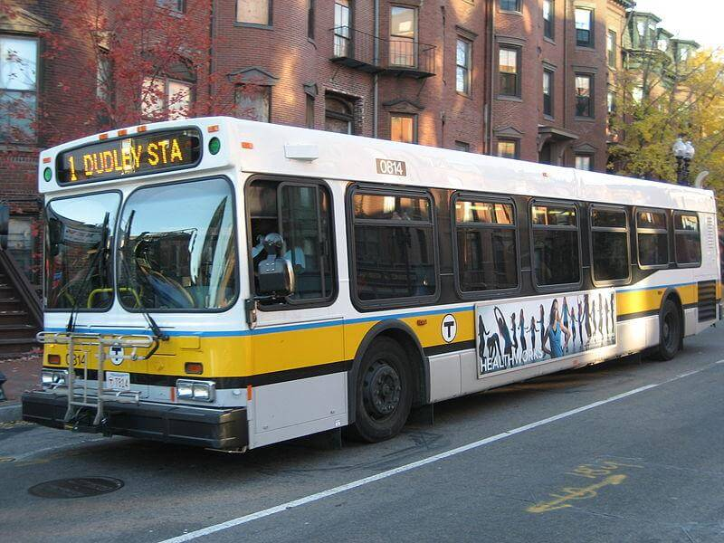

## Real Time Bus Tracker 👨‍💻

This is an exercise developed during MIT xPro Professional Certificate in Coding: Full Stack Development with MERN. 

The goal of this exercise is to fetch data from an API and use it to animate a map.

## Installation 🔧

To install this proyect in your machine, follow these steps:

1. Download or clone the project
2. Go to content folder and add it to your code editor tool
3. Open index.html

## Usage 🚀

To see this project running in live action please go to [Index.html](https://soydanielromero.github.io/projects/4-MIT-AnimatesMapChallenge/index.html) and follow the instructions.

## Support 🦸‍♂️️

If you have any question please send an email to: [hola@soydanielromero.com](mailto:hola@soydanielromero.com).

## Roadmap 🗺

This is a coding exercise and there won't be any fixes or improvements.

## License information 👨‍⚖️

Copyright (c) 2021 Daniel Romero

Permission is hereby granted, free of charge, to any person obtaining a copy
of this software and associated documentation files (the "Software"), to deal
in the Software without restriction, including without limitation the rights
to use, copy, modify, merge, publish, distribute, sublicense, and/or sell
copies of the Software, and to permit persons to whom the Software is
furnished to do so, subject to the following conditions:

The above copyright notice and this permission notice shall be included in all
copies or substantial portions of the Software.

THE SOFTWARE IS PROVIDED "AS IS", WITHOUT WARRANTY OF ANY KIND, EXPRESS OR
IMPLIED, INCLUDING BUT NOT LIMITED TO THE WARRANTIES OF MERCHANTABILITY,
FITNESS FOR A PARTICULAR PURPOSE AND NONINFRINGEMENT. IN NO EVENT SHALL THE
AUTHORS OR COPYRIGHT HOLDERS BE LIABLE FOR ANY CLAIM, DAMAGES OR OTHER
LIABILITY, WHETHER IN AN ACTION OF CONTRACT, TORT OR OTHERWISE, ARISING FROM,
OUT OF OR IN CONNECTION WITH THE SOFTWARE OR THE USE OR OTHER DEALINGS IN THE
SOFTWARE.

## Files 📁

- Root
    - index.html
    - LICENSE
    - README.md
    - project details.html
- /img
    - bostonbus.jpg
- /scripts
    - mapanimation.js
- /styles
    - styles.css